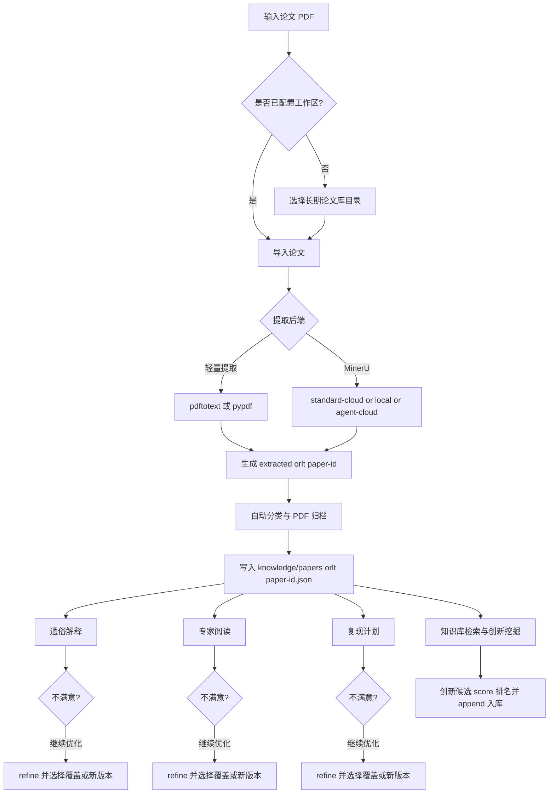

# Paper Research Workflow 论文研究技能

这是一个面向论文阅读、论文复现和创新点挖掘的自包含 Skills 技能包。它的发布形态是 **单个主技能**：

```text
skills/paper-research-workflow/
```

主技能内部已经包含运行所需的脚本、schema、模板和参考文档；六个子流程不会作为独立技能安装，而是作为内部参考文档打包在：

```text
skills/paper-research-workflow/references/child-skills/
```

## 安装

用户可以使用 `npx skills add` 直接从当前 GitHub 仓库安装：

```bash
npx skills add swordfate3/papers_skills --skill paper-research-workflow
```

## 包含能力

`paper-research-workflow` 内置以下论文研究流程：

- 论文输入、PDF 提取、分类和归档
- 通俗易懂解释论文
- 专家式深度阅读论文
- 论文复现计划和最小可行复现分析
- 文件型论文知识库写入与校验
- 从知识库检索相关论文并挖掘创新方向

## 可视化工作流

完整可视化说明见：[docs/论文研究技能可视化工作流.md](/home/fate/gitproject/papers_skills/docs/论文研究技能可视化工作流.md)



## Web 可视化工作台

技能包内置了一个 React/Vite Web 工作台模板，模板位置在：

```text
skills/paper-research-workflow/web/
```

首次 `setup` 时，这个模板会释放到用户选择的长期论文工作区：

```text
<paper-library>/web/
```

后续 `npm install`、`npm run dev`、服务状态和日志都发生在这个目标工作区副本中，不会写入 skill 安装目录。

`setup` 和后续维护命令会把真实工作区数据导出到：

```text
<paper-library>/web/public/paper-workbench-data.json
```

前端每 5 秒 hot-read 这个 JSON，所以它显示的是当前论文库里的真实分类、阅读入口、完整 Markdown 文档、复现计划和创新记录；如果导入新论文或生成了新阅读产物，可以运行 `refresh-data` 立即刷新数据文件。空工作区只显示空状态，不回退到假论文。技能包模板升级后，如果要刷新已释放的 Web 模板，使用 `web --web-command release --force-release`，它会先备份旧 `<paper-library>/web`，再干净复制新模板，并排除 `node_modules`、`dist`、`.vite`、lockfile 和 tsbuildinfo。

这个工作台把论文阅读流程可视化：左侧是论文分类，右侧先显示论文列表和阅读入口按钮，分别对应 `通俗易懂`、`专家阅读`、`复现计划`。点击入口后进入内置 Markdown 文档阅读器，完整阅读对应 `.md` 产物；阅读器底部有平台对话框，可以选择 `Codex`、`Claude Code` 或 `OpenClaw`，输入“讲得更详细”“专家阅读更关注实验缺陷”“复现计划改成 PyTorch 路线”等请求后，生成可交给对应平台继续执行的结构化任务文本。

`创新挖掘` 会显示创新点、合理性分数、排序和来源论文链接；点击来源论文会回到对应论文，并直接打开来源阅读文档，方便追踪一个创新想法来自哪几篇论文、哪些阅读产物。

本地启动：

```bash
cd skills/paper-research-workflow
python scripts/paper_workflow.py setup --workspace /path/to/paper-library --save-default
python scripts/paper_workflow.py web --web-command start --workspace /path/to/paper-library --host 127.0.0.1 --port 5173
python scripts/paper_workflow.py web --web-command status --workspace /path/to/paper-library
python scripts/paper_workflow.py web --web-command refresh-data --workspace /path/to/paper-library
python scripts/paper_workflow.py web --web-command validate-release --workspace /path/to/paper-library
```

构建验证：

```bash
python scripts/paper_workflow.py web --web-command test
python scripts/paper_workflow.py web --web-command build
```

服务维护：

```bash
python scripts/paper_workflow.py web --web-command logs --log-lines 120
python scripts/paper_workflow.py web --web-command stop
```

刷新已释放模板：

```bash
python scripts/paper_workflow.py web --web-command release --workspace /path/to/paper-library --force-release
```

## 语言模式

这个技能默认面向中文用户：对话、论文卡片、专家阅读、复现计划、创新简报和状态说明默认使用中文。论文标题、作者、方法名、模型名、数据集、指标、benchmark、命令和代码标识会尽量保留原文，避免翻译后失真。

也支持热切换：

```text
切换英文
English mode
切换中文
Chinese mode
```

示例：

```text
使用 paper-research-workflow，用 MinerU 读取并解释这篇论文：/path/to/paper.pdf
切换英文，继续生成 reproduction plan
切换中文，基于知识库挖掘新的创新点
```

## 目录结构

安装单元是一个完整技能目录：

```text
skills/paper-research-workflow/
  SKILL.md
  agents/openai.yaml
  scripts/
  schemas/
  templates/
  references/
    child-skills/
```

其中：

- `scripts/`：工作流 CLI、PDF 提取、分类、知识库检索、schema 校验
- `schemas/`：论文记忆、论文卡片、复现计划、创新简报的数据契约
- `templates/`：Markdown 和 JSON 输出模板
- `references/`：PDF/MinerU 说明和六个内部子流程

## 快速验证

首次使用时，先为论文库选择一个长期目录。之后所有论文 PDF、提取结果、论文卡片、专家阅读、复现计划、创新简报和知识库 JSON 都会保存在这个目录下。

进入已安装的 `paper-research-workflow` 技能目录，运行：

```bash
python scripts/paper_workflow.py setup --workspace /path/to/paper-library --save-default
python scripts/paper_workflow.py status
```

如果输出类似下面内容，说明基础工作区初始化正常：

```json
{
  "papers": {}
}
```

## 读取本地 PDF

处理普通本地 PDF，可以先不启用 MinerU：

```bash
python scripts/paper_workflow.py ingest /path/to/paper.pdf --no-mineru
```

运行后会生成：

```text
<paper-library>/
  extracted/<paper-id>/
  knowledge/papers/<paper-id>.json
  papers/
  state/papers.json
```

## PDF 提取依赖

轻量 PDF 提取优先使用：

```text
pdftotext -layout
```

如果系统没有 `pdftotext`，脚本会尝试使用 Python 包 `pypdf`。

复杂 PDF、扫描件、公式/表格较多的论文可以使用内置 MinerU 适配器。这个技能包不依赖别人本机已有的 MinerU skill，支持三种内置后端：

- `standard-cloud`：高质量云 MinerU，使用 https://mineru.net/apiManage/docs 的 v4 精准解析 API，需要 Token
- `agent-cloud`：轻量云 MinerU，使用 Agent 轻量解析 API，适合无 Token 的零配置场景
- `local`：优先调用技能包内置的 Docker MinerU，其次才回退到本机 `mineru`

如果希望使用高质量云解析，第一次先配置 Token：

```bash
python scripts/paper_workflow.py configure-mineru --standard-token <your-mineru-token>
```

Token 会保存到技能目录下的 `.paper-mineru.json`，后续使用无需再次配置。查看配置状态：

```bash
python scripts/paper_workflow.py configure-mineru --show
```

使用高质量云 MinerU 读取论文：

```bash
python scripts/paper_workflow.py ingest /path/to/paper.pdf --prefer-mineru --mineru-backend standard-cloud
```

也可以使用自动后端选择：

```bash
python scripts/paper_workflow.py ingest /path/to/paper.pdf --prefer-mineru --mineru-backend auto
```

`auto` 会按顺序选择 `MINERU_TOKEN` / 已保存 Token、本机 `mineru`、最后回退到 `agent-cloud`。

如果你希望走本地高质量 MinerU，可以先检查内置 Docker MinerU 状态：

```bash
python scripts/paper_workflow.py local-mineru --status
```

如果尚未启用，技能在工作流里应先询问用户“是否要启用本地 Docker MinerU”。用户确认后，再帮助执行：

```bash
python scripts/paper_workflow.py local-mineru --enable
```

如果用户机器上没有现成的 MinerU Docker 目录，还可以显式指定构建目录，让脚本自动下载 MinerU 官方源码归档中的完整 Docker 构建上下文再构建：

```bash
python scripts/paper_workflow.py local-mineru --enable --docker-dir /path/to/mineru-docker
python scripts/paper_workflow.py local-mineru --enable --docker-dir /tmp/mineru-build --source-archive-url https://github.com/opendatalab/MinerU/archive/refs/heads/master.tar.gz --source-subdir docker/global
```

只有在源码归档不可用时，才建议回退到单独指定 `--dockerfile-url`。

启用后即可直接使用：

```bash
python scripts/paper_workflow.py ingest /path/to/paper.pdf --prefer-mineru --mineru-backend local
```

`auto` 会按顺序选择 `MINERU_TOKEN` / 已保存 Token、内置 Docker MinerU 或本机 `mineru`、最后回退到 `agent-cloud`。

云 MinerU 默认不使用系统代理环境变量，避免错误代理导致 `mineru.net` 解析或连接失败。如果确实需要代理，显式设置：

```bash
MINERU_USE_PROXY=1 python scripts/paper_workflow.py ingest /path/to/paper.pdf --prefer-mineru --mineru-backend agent-cloud
```

高质量云 MinerU 上传到 OSS 预签名地址时，客户端默认不额外添加 `Content-Type` 请求头，避免签名头不一致导致 `SignatureDoesNotMatch`。
标准云解析默认使用 `model_version: vlm`，并为上传文件传入稳定的 `data_id`，便于 MinerU 批量任务结果追踪。

## 输出说明

每篇论文都会维护一份结构化论文记忆：

```text
<paper-library>/knowledge/papers/<paper-id>.json
```

这份 JSON 是机器可读的核心记录，包含：

- 论文基础信息
- 分类结果
- 核心问题、动机、方法、贡献
- 数据集、指标、baseline、ablation
- 假设、局限、失败模式
- 复现难度和最小可行复现
- 创新启发和相关论文链接

Markdown 输出会放在：

```text
<paper-library>/knowledge/cards/
<paper-library>/knowledge/expert-readings/
<paper-library>/knowledge/reproductions/
<paper-library>/knowledge/innovations/
```

## 开发验证

在仓库根目录运行：

```bash
uv run pytest -q
```

校验技能结构：

```bash
python /path/to/skill-creator/scripts/quick_validate.py skills/paper-research-workflow
```

当前设计目标是：别人只安装 `paper-research-workflow` 这一个技能目录，也能完成基础的论文读取、分类、入库和后续阅读流程。
