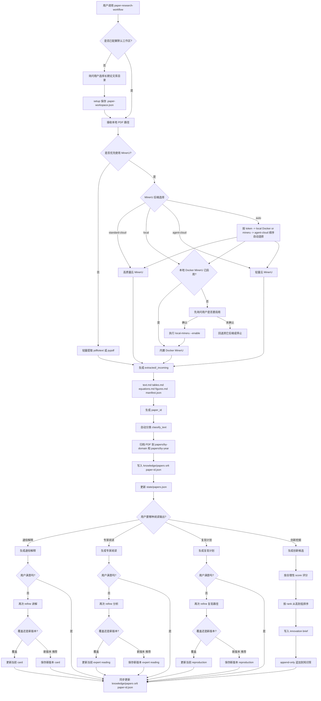
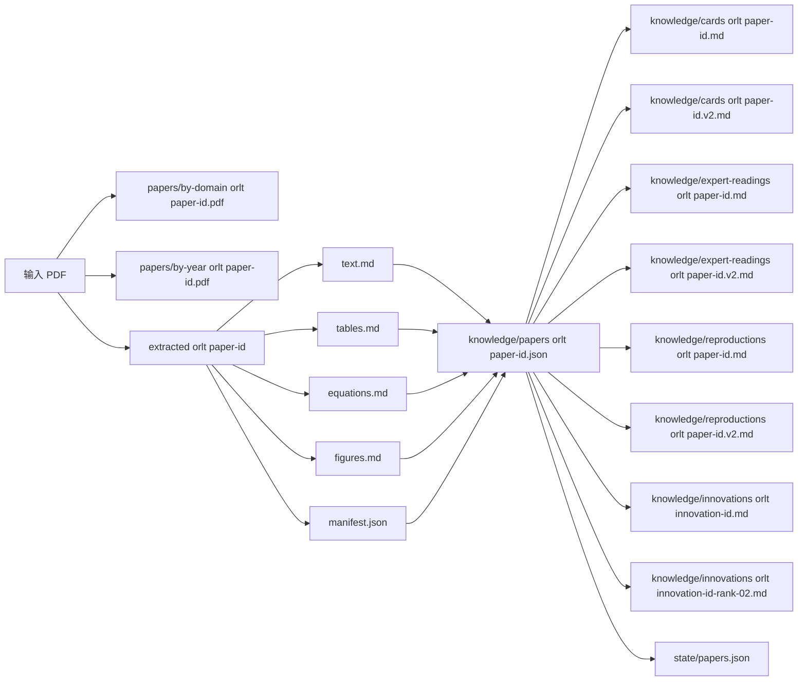
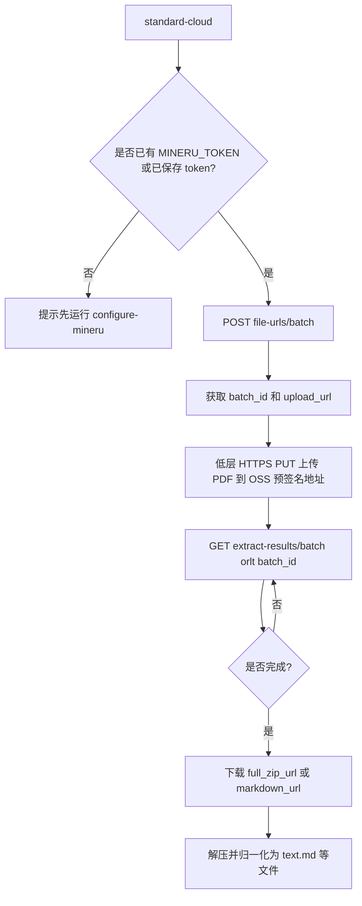
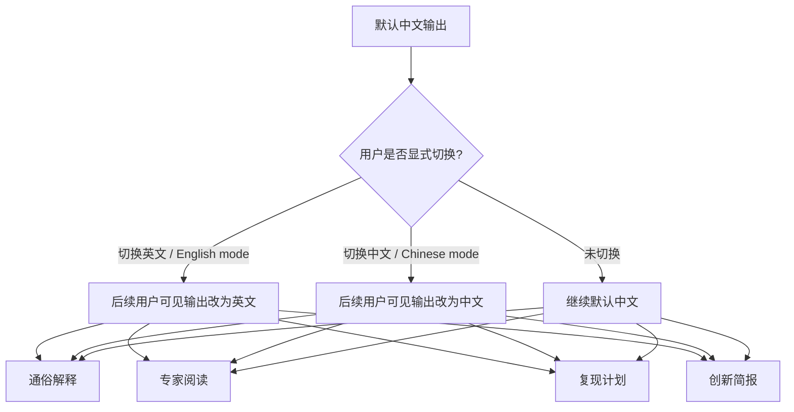
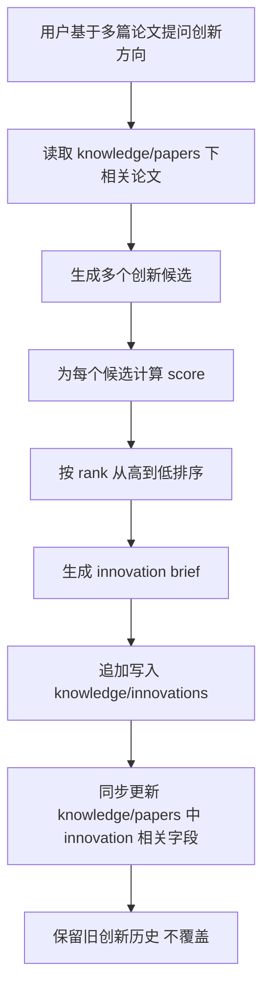

# 论文研究技能可视化工作流

本文档描述 `paper-research-workflow` 从“输入论文”到“知识库与创新挖掘”的完整工作流。

## 总流程

## 产物流向

## MinerU 云端细化流程

## 语言模式

## 创新排序与入库

## 说明

- `knowledge/papers/<paper-id>.json` 是核心机器可读主记录。
- `cards`、`expert-readings`、`reproductions`、`innovations` 是面向人阅读的 Markdown 产物。
- `state/papers.json` 记录每篇论文已经完成到哪个阶段。
- 多篇论文共享同一个长期工作区，后续新论文进入时会在各自目录下新增同级文件。
- 本地 `local` 后端优先走技能包内置的 Docker MinerU；如果尚未启用，先询问用户是否要启用，确认后再执行 `python scripts/paper_workflow.py local-mineru --enable`。
- `local-mineru --status` 会区分 Docker 未安装、Docker daemon 未启动、镜像未构建三种状态；`local-mineru --enable` 可直接指定 `--docker-dir`，优先通过官方源码归档和 `--source-subdir` 准备完整构建上下文，只有必要时才回退到 `--dockerfile-url`。
- 阅读类输出现在支持“用户不满意就继续优化”，并在覆盖或另存新版本之间做选择，推荐默认保留旧版并另存新版本。
- 创新挖掘现在支持基于多篇论文生成排序结果，并以 append-only 方式追加到知识库，不覆盖旧创新历史。
