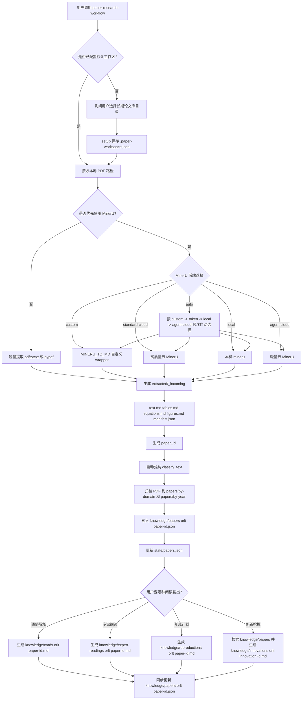
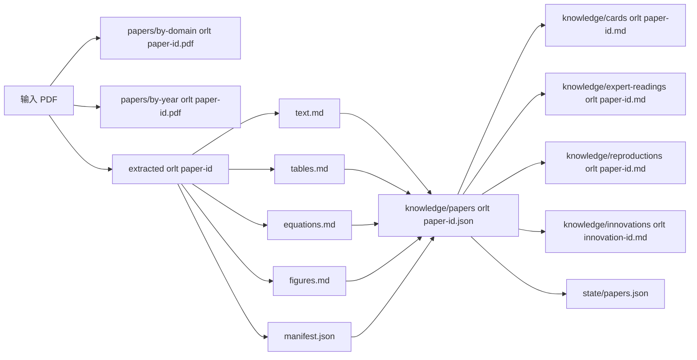
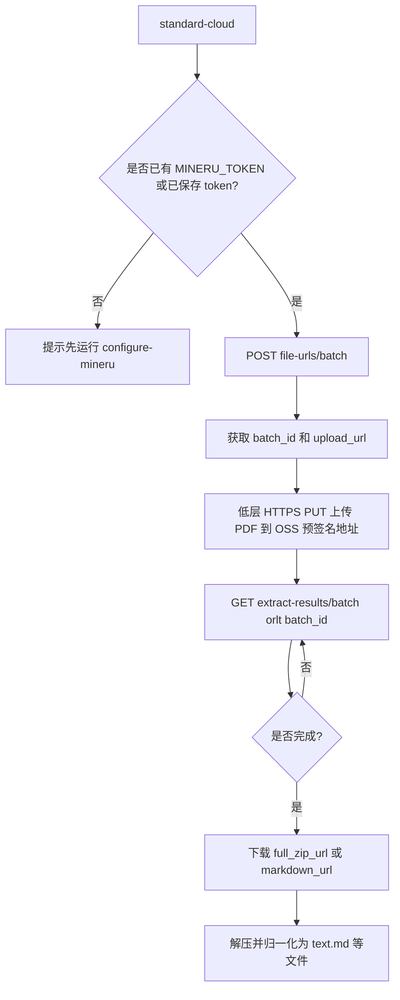
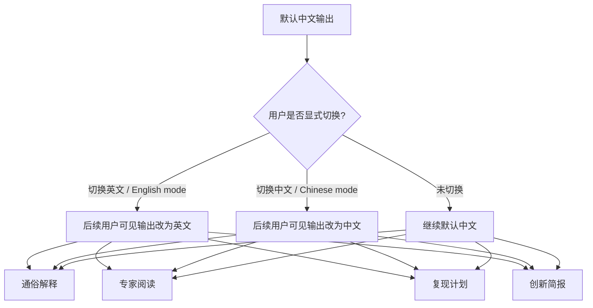

# 论文研究技能可视化工作流

本文档描述 `paper-research-workflow` 从“输入论文”到“知识库与创新挖掘”的完整工作流。

## 总流程

## 产物流向

## MinerU 云端细化流程

## 语言模式

## 说明

- `knowledge/papers/<paper-id>.json` 是核心机器可读主记录。
- `cards`、`expert-readings`、`reproductions`、`innovations` 是面向人阅读的 Markdown 产物。
- `state/papers.json` 记录每篇论文已经完成到哪个阶段。
- 多篇论文共享同一个长期工作区，后续新论文进入时会在各自目录下新增同级文件。
